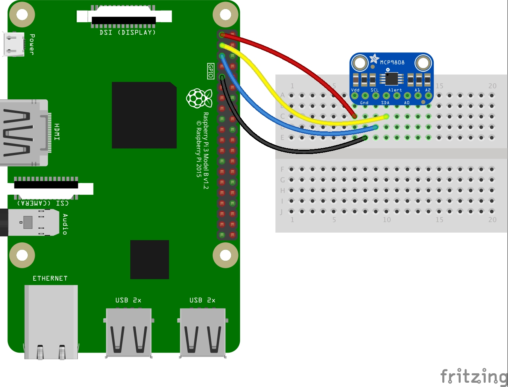

# mcp9808-thing

This script reads an MCP9808 temperature sensor from a Raspberry Pi and updates an AWS Iot Thing Shadow.

## Prerequisites

### Wire up the MCP9808


## Building

For a Raspberry Pi Zero
```
make
```

## Execute the script
```
./mcp9808-thing -thing=<thing_name> -endpoint=<endpoint> -privatekey=<key_path> -cert=<cert_path> -rootca=<rootCA_path> -logfile=<log_path>
```

### Create a start script

Create a `.env` file with the following:
```
export THING_NAME=<Thing name>
export ENDPOINT=<Thing endpoint>
export PRIVATE_KEY_PATH=<path to private key>
export CERT_PATH=<path to cert>
export ROOT_CA_PATH=<path to root ca>
export LOG_FILE_PATH=<path to log file>
```

Create a `start` script to convert env variables to flags and execute the binary
```
#!/bin/bash

source .env

./mcp9808-thing \
  -thing=${THING_NAME} \
  -endpoint=${ENDPOINT} \
  -privatekey=${PRIVATE_KEY_PATH} \
  -cert=${CERT_PATH} \
  -rootca=${ROOT_CA_PATH} \
  -logfile=${LOG_FILE_PATH}
```

Execute the script
```
./start
```
